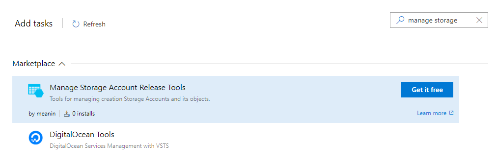

# Introduction

Azure is a great cloud platform. Configuring CI/CD on an Azure DevOps is a really nice experience. You can create a build pipeline, where your software will be built and packaged into an installation artefact. You can also create a whole release pipeline. Usually only deploying the artefact to some `cloud` space. While I was playing with it, I miss some tasks which will prepare a brand new environment on my behalf.

Imagine that you can have multiple environments, consisting of a great number of services, each connected to different database. You are creating a new one and want to check if all others work well, that nothing is broken by the new one. I would create a whole new environment, deploy there infrastructure, deploy services and run unit tests, integration tests and regression tests to be sure, that all components are in a good health.

The parts that I cannot find on an Azure DevOps platform are tasks which enable me to create databases and store connection strings, securely. Later on a deployment, pass this connection string into service configuration, without passing it as a plain text to any solution file. And that is how I start working on Azure DevOps extensions.

# Install extension

An Azure Storage Account is a basic NoSQL database available on an Azure cloud. Simple document database for storing not relational data.

To install this extension, you need an organization on Azure DevOps portal. You can start [here](https://azure.microsoft.com/en-us/services/devops/?nav=min). On this portal, you have to have rights to install extensions. Then navigate [here](https://marketplace.visualstudio.com/items?itemName=meanin.storage-account-managment), or search for a `manage storage account release tools` in a release pipeline window like below:

# Configure task

To use this task you have to have a [configured](https://docs.microsoft.com/en-us/azure/devops/pipelines/library/service-endpoints?view=vsts#sep-azure-rm) Azure Resource Manager connection with a Service Principal. Set your new storage account name (it is required, but if the storage account exists, it won't break anything). Set location for your storage account, you can keep it default, then it will be inherited from a resource group location. Last required thing is to set [Sku](https://docs.microsoft.com/en-us/rest/api/storagerp/skus/list) (Performance tiers). If you want to, you can create a table in a table storage by setting a name for it.

# Limitations

This is first published version for an extension. Currently, only supported version of storage is Storage v1. I will appreciate all feedback :)