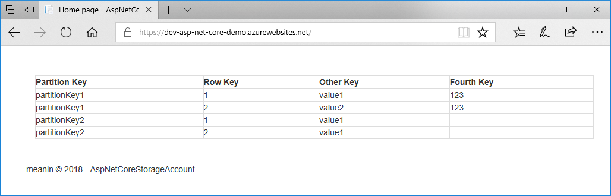

# Introduction

Continuous Integration helps teams work in parallel on the same project. The most common scenario is to use some git server and integrate work as a pull request from a feature branch to development one. Many tools provide an easy way to build an artefact (installation package) from a merged code base. Continuous deployment is a way to maintain application state with the newest code base on the desired environment.

Imagine that before pushing new changes to production, you want to make all of the tests in a dedicated environment. Or maybe on every newly created environment you want to seed some data? Sometimes on this specific environment data stored/missing can introduce unnecessary bugs or unwanted situations which require your attention, before it can be considered tested/usable.

# Idea

I came up with an idea on how to create a brand new environment, just for testing purposes. This way, you can always be sure, that there is no old data, but only data that is required for the system to work the right way. Nothing will interfere with test cases, no blockers on a fresh start. 

I am using Microsoft Azure Cloud, as it is most familiar to me. In the simplest case, I want to create a storage (Azure Table Storage), pass its connection string to the key vault (centralized storage for secrets), seed data there and finally deploy an application which will consume the data.

# Solution

### 1. Create a storage account
There are few ways to create a storage account on Microsoft Azure Cloud. For a start, there is an Azure Portal - the web interface for managing your cloud resources. If you are more familiar with devops' work, you would use [Azure Powershell](https://docs.microsoft.com/en-us/powershell/azure/overview?view=azurermps-6.12.0) (cross-platform right now) or [Azure CLI](https://docs.microsoft.com/en-us/cli/azure/?view=azure-cli-latest).

In my scenario, I want to integrate the storage account creation process with continuous deployment process. I could write some PowerShell script and add it as a step to my CD definition. I could also write some custom extension for my CI/CD tool, which would give me a nice view for creating new storage account :) I am working with [Azure DevOps](https://azure.microsoft.com/en-us/services/devops/) (which is a successor to Visual Studio Team Services). After some fights with diving into Azure DevOps extension development, I ended up with something like described on one of my previous posts:


It looks like below. Nice right? Instead of fighting with some PowerShell you can consume well-designed UI for creating the resource you need.


### 2. Pass connection string to Key Vault
Using a different database/storage in each environment could be difficult. One way is to use a dedicated configuration file for each environment, but then credentials are stored in a version control system. The second way is to configure a dedicated hosting environment to have credentials stored there, but it creates a problem with configuring the new environment. All credentials need to be known before anything is deployed.

Happily, there is another way, which is my favourite. Store all of the necessary credentials outside of source control and fetch real values (override configuration file) on CD process. It can be done in a dedicated centralized storage for secrets. The Microsoft Azure Cloud provides a component that is called [Azure Key Vault](https://docs.microsoft.com/en-us/azure/key-vault/key-vault-overview). The Azure DevOps portal provides an easy way to fetch data from a key vault, you can read more about it on [Microsoft docs](https://docs.microsoft.com/en-us/azure/devops/pipelines/library/variable-groups?view=vsts&tabs=yaml).

So I came up with an idea to push a connection string for my newly created Storage Account to the selected Key Vault during the CD process, just after creation is completed. I didn't find any existing way to do that, besides inline PowerShell/CLI script. I decided to create another task for the Azure DevOps, also described in a dedicated post:


As previously, I believe that developers who work on a code base, shouldn't care about configuring deployment scripts. It looks like below:


### 3. Seed Table Storage
Have you ever store data without which product won't work on a database side? Data that is not permanent, that mutate during application lifetime, so there is need to be stored in a DB, but without which application will not start. I imagine some user configuration values, defaults that are handled by admin, etc. For that case, usually missing part is seed functionality. Again I cannot find anything that works out of the box. 

The more I get into developing the Azure DevOps extension, the more idea for new tasks I find. Now I created one that helps to seed data into the Azure Table Storage. See my post:

It needs an input JSON file, with predefined two fields which are Azure Table Storage restriction - PartitionKey and RowKey. Any other field can names as needed by an application. The task configuration needs an Azure subscription, Storage Account Name, table name and of course path to seed file. In this case, it is a local JSON file.


### 4. Application deployment
A default way to host an application in an Azure Cloud is to deploy it to an App Service. It supports multiple languages like c#/.net, Java, PHP, static websites (Angular/React/others), even node.js or python. It is able to use Windows OS, Linux, or docker container. Review the Microsoft documentation to learn [more](https://docs.microsoft.com/en-us/azure/app-service/app-service-web-overview). Configuration is pretty straightforward. There are few fields that need your attention, like Azure subscription, App type and App Service Name. For more information, please visit this [page](https://docs.microsoft.com/en-us/azure/devops/pipelines/targets/webapp?toc=/azure/devops/deploy-azure/toc.json&bc=/azure/devops/deploy-azure/breadcrumb/toc.json&view=vsts).

# Summary
With some effort, now I am able to deploy a complete environment through the Azure DevOps release pipeline. A Storage Account/table is created as a first step. The connection string is passed to the Key Vault as secret. Next desired table is filled with seed data. Last, the application is deployed with credentials fetched from the Key Vault, configuration values are overwritten. From the developer's perspective, it is transparent to which database, which table application is writing/reading to/from on this specific environment. They can focus on delivering functionality, instead of fighting with deployment process, connection strings, validation, credentials, etc. 

For the end, I prepared short asp.net core demo project, which reads all data from the Azure Table Storage table and presents it on a website. A code base can be found on my github:

As you can see in the config file, there is only connection string to a local emulator, instead of real Azure Table Storage instance.
```C#
{
  "Logging": {
    "LogLevel": {
      "Default": "Warning"
    }
  },
  "AllowedHosts": "*",
  "ConnectionString": "UseDevelopmentStorage=true",
  "DemoTableName": "MyTable"
}
```
Also included is a seed.json file, which could be fetched from somewhere else, but for simplicity it is stored within a code base.
```
[
  {
    "PartitionKey": "partitionKey1",
    "RowKey": "1",
    "OtherColumn": "value1",
    "FourthColumn": "123"
  }    ...
]
```
A few minutes after triggering release, I saw this, brand new web application, displaying a table the source code base knows nothing about. Voila!


# P.S.
No, not PowerShell ;) If you have any needs to extend the Azure DevOps, with some shiny new deployment task, you can contact me :)